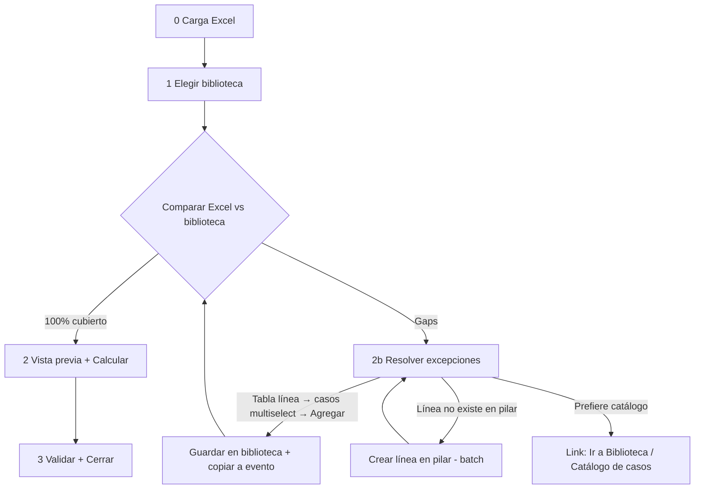

# OT-MOTOR-REING-519-001 — Reingeniería Motor de Precios: Biblioteca ↔ Excel en &lt; 5 min

**Estado:** PENDIENTE (Claude Code)  
**Fecha:** 2026-05-18  
**Repo:** https://github.com/segoviaranonis-dev/ventas_por_mes_rimec.git  
**Prioridad:** ALTA (bloquea operación diaria del director)  
**Relacionadas:** OT-515 (Paso 3 UX), OT-516 (Paso 4), OT-517 (Paso 5) — **integrar**, no duplicar parches.

---

## 1. Problema

El flujo actual es largo y repetitivo:

| Hoy | Tiempo típico (Cloud) |
|-----|------------------------|
| 0 Carga Excel | 1–2 min |
| bib_select + opcional bib_editor | 1–3 min |
| **1 Memoria** (re-elige biblioteca/evento) | 30 s – 2 min |
| **2 Matriz casos** (formularios, barreras, analizar) | 5–15 min |
| **3 Preview/cálculo** + provisionar pilares | **20–40 min** |
| 4 Validación / 5 Cierre | 2–10 min |

El director necesita un flujo **operativo**, no un wizard de 6 pantallas:

1. **Seleccionar biblioteca**
2. **Comparar biblioteca vs Excel**
   - **Coincide** → Vista previa → **Finalizar** (cálculo + cierre)
   - **No coincide** → Resolver **solo excepciones** en una tabla corta y seguir

**SLA de producto:** preparación (pasos 1–2 del flujo nuevo) **≤ 5 minutos** en Streamlit Cloud con listado típico (~50–100 SKUs, 1 biblioteca ya armada).

---

## 2. Flujo objetivo (única verdad UX)



### Barra de progreso nueva (6 → 4 pasos visibles)

| Índice | Etiqueta | Contenido |
|--------|----------|-----------|
| 0 | **Carga** | Excel + proveedor + nombre evento (igual hoy) |
| 1 | **Biblioteca** | Select biblioteca + **comparación** + resolución gaps |
| 2 | **Preview** | Cálculo precios (OT-515 progreso 1/N) |
| 3 | **Cierre** | Validación mínima + cerrar (OT-517 rápido) |

**Eliminar de la barra principal:** “Memoria”, “Casos” como pasos separados. La matriz de casos **no se edita a mano** en el happy path.

---

## 3. Reglas de negocio (comparación)

Implementar en **`modules/rimec_engine/biblioteca_compare.py`** (archivo nuevo):

```python
@dataclass
class ComparacionBibliotecaExcel:
    lineas_excel: set[str]           # códigos proveedor únicos del Excel
    lineas_biblioteca: set[str]      # unión de caso_precio_biblioteca.lineas
    lineas_pilar: set[str]           # códigos en tabla linea del proveedor
    cubiertas: set[str]              # excel ∩ biblioteca (cada línea en ≥1 caso)
    sin_caso: list[str]              # en pilar, en excel, NO en ningún caso de la bib
    no_en_pilar: list[str]           # en excel, NO en linea (proveedor)
    ok: bool                         # sin_caso vacío y no_en_pilar vacío
```

**Algoritmo (rápido, una pasada SQL + sets en memoria):**

1. Extraer `lineas_excel` desde `re_skus` (columna `linea` / equivalente ya usada en `validar_barrera_contenedor_excel`).
2. Cargar biblioteca con `plantilla_casos_desde_biblioteca` + `BibliotecaEditorState` o query directa a `caso_precio_biblioteca.lineas`.
3. Cargar `pilar_lineas` con `cargar_pilar_datos(proveedor_id)` (reutilizar `biblioteca_maestro.py`).
4. Clasificar filas del gap en **dos tipos** (UI con badge):
   - **Sin caso** — línea existe en pilar, falta en biblioteca.
   - **No en pilar** — línea del Excel aún no existe en `linea`.

**No** usar `linea.caso_id` para resolver (P2 integridad).

---

## 4. Pantalla “No coincide” (2b) — sin perorata

Una sola tabla `st.data_editor` o filas `st.columns` compactas:

| Línea | Tipo | Casos (multiselect) | Acción |
|-------|------|---------------------|--------|
| `4054` | Sin caso | `ACT-BRSPORT`, `BR-VZ` | **Agregar a biblioteca** |
| `9999` | No en pilar | — | **Crear en pilar** (usa `provisionar_lineas_faltantes_en_pilar` batch) |

**Comportamiento botón “Agregar a biblioteca”:**

- Para cada fila: `guardar_lineas_caso_directo` / `actualizar_lineas_en_biblioteca` (existente en `logic.py` / `biblioteca_maestro.py`) — **añadir** códigos al/los caso(s) elegidos (unión, no reemplazo).
- Luego `aplicar_biblioteca_a_evento` (o solo copiar delta al evento actual).
- **Un** `commit` por lote; máximo 1 `st.rerun()` al terminar el lote.
- Mensaje: “Listo. Volvé a **Comparar** o continuá si ya está verde.”

**Multiselect de casos:** solo casos **de esa biblioteca** (`state.casos.keys()`).

**Link secundario (no bloqueante):**

> “¿Querés armar casos nuevos? → **Catálogo de casos**”  
> Abrir con `st.session_state` + query param o botón que setee `re_paso` al maestro biblioteca **sin perder** `re_evento_id` / `re_skus` (flag `re_volver_tras_biblioteca=True`).

**Prohibido en esta pantalla:** editor glass completo, acordeón por caso, “Memoria del evento anterior”, formulario largo `_form_caso_listado`.

---

## 5. Happy path “Coincide”

Secuencia automática tras comparación OK:

1. `aplicar_biblioteca_a_evento(evento_id, proveedor_id, biblioteca_id)` — ya existe.
2. `hydrate_casos_evento_desde_db` + `asegurar_contenedor_lineas_excel` (sin UI intermedia).
3. `resolver_casos_skus` en memoria; si `ready_to_calc` → **ir directo a Preview** (`re_paso = 2` en barra nueva).
4. Botón único: **“Calcular listado”** (Paso 3 actual, con OT-515).
5. Tras cálculo: banner **Continuar a validación/cierre** (OT-516).

**Provisionar pilares:** solo en el click de calcular (o batch previo al calcular), **nunca** en bib_select ni en comparación. Reutilizar `asegurar_pilares_para_listado` una sola vez.

---

## 6. Cambios por archivo

| Archivo | Acción |
|---------|--------|
| `modules/rimec_engine/biblioteca_compare.py` | **NUEVO** — `comparar_excel_vs_biblioteca(...)` |
| `modules/rimec_engine/biblioteca_ui.py` | Reemplazar `render_seleccion_biblioteca_post_carga` por flujo **Seleccionar → Comparar → Resolver/Continuar** |
| `modules/rimec_engine/ui.py` | Barra 4 pasos; **saltar** `_paso_1_memoria` y `_paso_2_casos` si `re_biblioteca_ok`; mantener pasos legacy detrás de flag `re_flujo_legacy=False` por 1 release |
| `modules/rimec_engine/biblioteca_maestro.py` | Helper `agregar_lineas_a_casos_biblioteca(bib_id, {caso: [lineas]})` batch |
| `modules/rimec_engine/logic.py` | Export fino; no duplicar comparación |
| `docs/OT_REGISTRO_ESTADO.md` | Fila OT-519 |

**No tocar:** `registro_ventas_general_v2`, `caso_precio_web_regla`, `fn_precio_venta_web`, reset 511.

---

## 7. Rendimiento (criterios de aceptación)

| Métrica | Objetivo |
|---------|----------|
| Comparación bib vs Excel | **&lt; 3 s** (solo lectura BD + sets) |
| Resolver ≤ 10 líneas gap + guardar | **&lt; 30 s** |
| Carga → Preview listo (coincide, sin calcular) | **&lt; 2 min** |
| Cálculo 50–100 SKUs | fuera de alcance de UI; mantener OT-515 progreso |

**Técnicas obligatorias:**

- Cache `re_lineas_excel_set` al cargar Excel (Paso 0).
- Una query pilar + una query biblioteca por comparación (no N+1 por línea).
- `proceso_largo` solo en cálculo y crear líneas pilar (&gt; 5 filas).
- No llamar `sincronizar_marca_linea_desde_evento` en preparación.

---

## 8. Fases de implementación (Claude)

### Fase A — Motor comparación + tests unitarios ligeros
- `biblioteca_compare.py` + función pura testeable con fixtures pequeños.

### Fase B — UI Biblioteca unificada
- Tras Paso 0 → `re_paso = "bib_flow"` (o `1`).
- Pantalla: selectbox biblioteca + botón **Comparar con Excel**.
- Semáforo: verde “Coincide (N líneas)” / ámbar “Faltan M líneas”.
- Botones: **Continuar a Preview** (solo si verde) | **Resolver excepciones**.

### Fase C — Tabla resolver + batch persist
- Multiselect casos por línea.
- Crear en pilar batch.
- Re-comparar automático tras guardar.

### Fase D — Cableado happy path + deprecar pasos 1–2
- Si `re_biblioteca_ok`: `re_paso = 2` (preview index).
- Feature flag `RE_FLUJO_SIMPLE = True` en `ui.py` (constante módulo, default True).

### Fase E — Evidencia + git
- `OT-MOTOR-REING-519-001-EVIDENCIA.json` con tiempos medidos (timestamp diff en logs o campo `duracion_ms` en comparación).
- Commit + push `main`.

---

## 9. Pruebas manuales (director)

| # | Escenario | Esperado |
|---|-----------|----------|
| T1 | Biblioteca al día, Excel mismo proveedor | Comparar verde → Preview en &lt; 2 min |
| T2 | 3 líneas nuevas en Excel, ya en pilar, sin caso | Tabla “Sin caso” → multiselect → Agregar → verde |
| T3 | 2 líneas no en pilar | Crear en pilar → asignar caso → verde |
| T4 | Usuario abre Catálogo biblioteca y vuelve | No pierde evento ni Excel |
| T5 | Sin biblioteca (skip) | Mensaje claro: crear biblioteca en Catálogo; **no** caer en Memoria+Matriz larga |

---

## 10. Git

```powershell
cd C:\Users\hecto\Documents\Prg_locales\ventas_por_mes_rimec-main
git add modules/rimec_engine/biblioteca_compare.py modules/rimec_engine/biblioteca_ui.py modules/rimec_engine/biblioteca_maestro.py modules/rimec_engine/ui.py docs/OT_REGISTRO_ESTADO.md
git commit -m "feat(motor): flujo simple biblioteca vs excel bajo 5 min (OT-519)"
git push origin main
```

---

## 11. Prohibido (Auto / CONTROL_INTEGRIDAD)

- Parche `%` o diccionario precio paralelo (P1).
- `linea.caso_id` para asignar caso comercial (P2).
- TRUNCATE biblioteca/pilares (P3).
- Silenciar errores de comparación con `except: pass`.
- Mantener Paso 1 Memoria **y** bib_select como doble elección sin flag legacy.
- Cálculo automático al cargar Excel (debe ser click consciente).

---

## 12. Fuera de alcance (otras OT)

- Reescribir `calcular_precios_caso` / fórmulas dólar.
- Depósito web / traspaso (OT-510).
- Digitación IC (OT-518).

---

## 13. Prompt corto para Claude Code

```
OT-MOTOR-REING-519-001 — ventas_por_mes_rimec

Reingeniería Motor de Precios: flujo director en <5 min.
Leer OT-MOTOR-REING-519-001.md completo.

Resumen:
- Nuevo biblioteca_compare.py: comparar Excel vs biblioteca vs pilar.
- UI: tras carga → elegir bib → Comparar → si OK → Preview; si no → tabla línea + multiselect casos + "Agregar a biblioteca" / "Crear en pilar" batch.
- Eliminar del happy path: Paso Memoria + Matriz manual (flag legacy).
- Barra 4 pasos: Carga | Biblioteca | Preview | Cierre.
- No provisionar pilares hasta Calcular. Reusar OT-515/516/517.
- Evidencia JSON + push main.

No pedir confirmación al director.
```

**No marcar CERRADA sin evidencia y auditoría Auto.**
